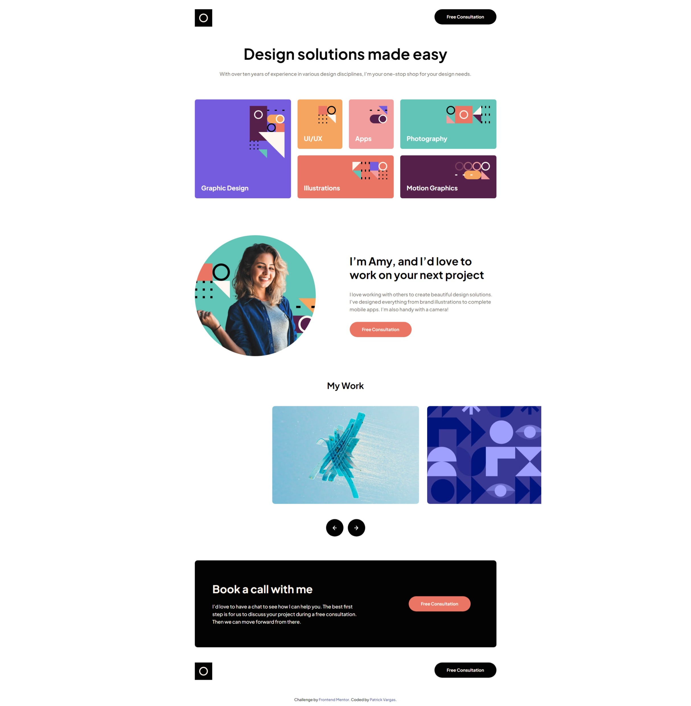

# Frontend Mentor - Single-page design portfolio solution

This is a solution to the [Single-page design portfolio challenge on Frontend Mentor](https://www.frontendmentor.io/challenges/singlepage-design-portfolio-2MMhyhfKVo). Frontend Mentor challenges help you improve your coding skills by building realistic projects.

## Table of contents

- [Overview](#overview)
  - [The challenge](#the-challenge)
  - [Screenshot](#screenshot)
  - [Links](#links)
- [My process](#my-process)
  - [Built with](#built-with)
  - [What I learned](#what-i-learned)
  - [Continued development](#continued-development)
  - [Useful resources](#useful-resources)
- [Author](#author)

## Overview

### The challenge

Users should be able to:

- View the optimal layout for the site depending on their device's screen size
- See hover states for all interactive elements on the page
- Navigate the slider using either their mouse/trackpad or keyboard

### Screenshot



### Links

- Solution URL: [GitHub](https://github.com/patrickbvargas/single-page-design-portfolio)
- Live Site URL: [Vercel](https://single-page-design-portfolio-patrickbvargas.vercel.app/)

## My process

### Built with

- Semantic HTML5 markup
- CSS custom properties
- Flexbox
- CSS Grid
- BEM + Namespaces methodology on classname

### What I learned

Use BEM + Namespaces methodology on classname

```html
<section class="c-presentation" aria-label="Presentation">
  <div class="c-presentation__image">
    
  </div>
  <div class="c-presentation__content">
    <h2 class="c-presentation__title">
      I’m Amy, and I’d love to work on your next project
    </h2>
    <p class="c-presentation__description">
      I love working with others to create beautiful design solutions. I’ve
      designed everything from brand illustrations to complete mobile apps. I’m
      also handy with a camera!
    </p>
    <a class="c-button c-button--light" href="#">Free Consultation</a>
  </div>
</section>
```

### Continued development

I will focus my studies on the following topics

- Responsive layout
- CSS preprocessor
- Mobile First workflow

### Useful resources

- [BEM Methodology](https://getbem.com/)
- [Namespaces](https://csswizardry.com/2015/03/more-transparent-ui-code-with-namespaces/)

## Author

- GitHub - [Patrick Vargas](https://github.com/patrickbvargas)
- Frontend Mentor - [@patrickbvargas](https://www.frontendmentor.io/profile/patrickbvargas)
